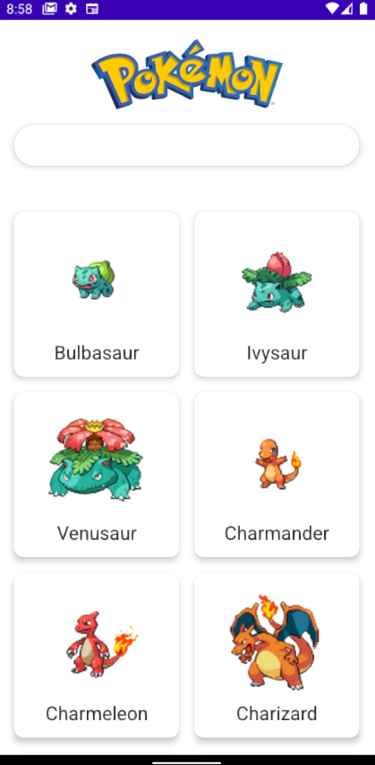

# Android Live Soccer App

Pokemon List Screen

Pokemon Detail Screen (in progress)

Tech stack included :

- [Jetpack Compose](https://developer.android.com/jetpack/compose) (UI Toolkit Framework)
  Jetpack Compose is Android’s modern toolkit for building native UI. It simplifies and accelerates UI development on Android. Quickly bring your app to life with less code, powerful tools, and intuitive Kotlin APIs.

- [Dagger Hilt](https://developer.android.com/training/dependency-injection/hilt-android) (Dependency Injection)
  Hilt provides a standard way to use DI in your application by providing containers for every Android class in your project and managing their lifecycles automatically.

- [ViewModel](https://developer.android.com/topic/libraries/architecture/viewmodel) (Architecture Component)
  The ViewModel class is designed to store and manage UI-related data in a lifecycle conscious way. The ViewModel class allows data to survive configuration changes such as screen rotations.

- [Coil Compose](https://github.com/coil-kt/coil) (Image Loader for Compose)
  An image loading library for Android backed by Kotlin Coroutines.

- [LiveData](https://developer.android.com/topic/libraries/architecture/livedata) (Architecture Component)
  LiveData is an observable data holder class. Unlike a regular observable, LiveData is lifecycle-aware, meaning it respects the lifecycle of other app components, such as activities, fragments, or services. This awareness ensures LiveData only updates app component observers that are in an active lifecycle state.

- [Material Design Component](https://material.io/components/) (Design)
  Material Components are interactive building blocks for creating a user interface.

- [Retrofit](https://github.com/square/retrofit) (Network Request)
  Type-safe HTTP client for Android and Java/Kotlin by Square, Inc. https://square.github.io/retrofit/

Happy Coding :)

